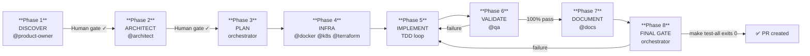
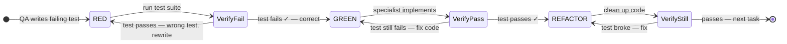

# The 8-Phase Pipeline

The AI Development Squad runs every feature through a fixed, phase-gated pipeline. No phase can be skipped. Three consecutive failures on any task escalate to a human.



---

## Phase Details

| # | Phase | Agent(s) | Human gate | Artifacts |
|---|---|---|---|---|
| 1 | **DISCOVER** | `@product-owner` | ✅ Yes | `stories.md`, `acceptance-criteria.md` |
| 2 | **ARCHITECT** | `@architect` | ✅ Yes | `architecture.md`, `adr.md`, `contracts/`, `threat-model.md` |
| 3 | **PLAN** | orchestrator | — | `plan.md`, `test-plan.md` |
| 4 | **INFRA** | `@docker`, `@kubernetes`, `@terraform`, `@postgresql` | — | `docker-compose.yml`, manifests, modules |
| 5 | **IMPLEMENT** | `@qa` + specialist agents | — | Source code, test files |
| 6 | **VALIDATE** | `@qa` | — | Validation report |
| 7 | **DOCUMENT** | `@docs` | — | Feature docs, CHANGELOG entry, runbooks |
| 8 | **FINAL GATE** | orchestrator | — | Completion summary, PR |

All artifacts land in `docs/specs/{feature-slug}/`. The orchestrator enforces order — specialists cannot jump phases.

---

## The TDD Loop (Phase 5)

Each task in the plan goes through a strict RED → GREEN → REFACTOR cycle before the next task starts.



The QA agent writes the failing test **first**. If the test passes before any implementation work, QA rewrites it — a passing test at RED stage means it tested the wrong thing.

---

## Makefile Contract

Every phase uses the same `make` targets. Agents, CI, and humans all share one interface.

```bash
make build            # Build all artifacts
make test             # Unit tests
make test-integration # Integration tests (spins up containers automatically)
make test-e2e         # Playwright E2E tests
make test-contract    # Contract / schema tests
make test-all         # Full suite — the Phase 8 gate
make lint             # Lint
make security-scan    # Security scanning
make fmt              # Format code
make containers-up    # Start PostgreSQL + Redis test containers
make containers-down  # Stop and remove containers
make seed-test        # Seed test database
make migrate          # Run database migrations
```

The Makefile ships with stubs. **Replace the recipe bodies with your stack's actual commands before running any feature.**

---

## Escalation Policy

If a specialist agent fails the same task three consecutive times, the orchestrator:

1. Stops retrying
2. Writes a `BLOCKED.md` in `docs/specs/{feature-slug}/`
3. Prompts the human for intervention before resuming

This prevents infinite loops and surfaces genuinely hard problems early.
