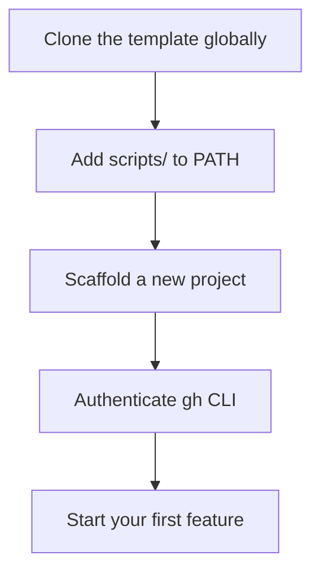
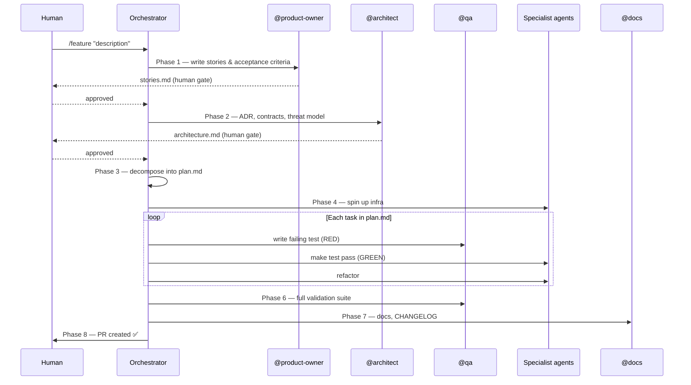

# Quickstart — Claude Code

This guide gets you from zero to a running feature pipeline using **Claude Code Max** and the AI Development Squad template.

---

## Prerequisites

| Tool | Install |
|---|---|
| [Claude Code](https://claude.ai/claude-code) | `npm install -g @anthropic-ai/claude-code` |
| [GitHub CLI](https://cli.github.com) | `brew install gh` |
| [Git](https://git-scm.com) | pre-installed on macOS/Linux |
| [Node.js](https://nodejs.org) | `brew install node` (for Playwright E2E tests) |
| [Docker](https://docker.com) | [docker.com/get-started](https://docker.com/get-started) |
| [Zellij](https://zellij.dev) | `brew install zellij` (swarm mode only, >= 0.41.0) |

**License required:** Claude Code Max subscription (includes `claude-opus-4-6` and `claude-sonnet-4-6`).

---

## Installation



### 1. Install the CLI globally

```bash
git clone https://github.com/kinncj/AI-Development-Squad-Template.git ~/.ai-squad
echo 'export PATH="$HOME/.ai-squad/scripts:$PATH"' >> ~/.zshrc
source ~/.zshrc
```

Verify:

```bash
ai-squad help
```

### 2. Scaffold a new project

```bash
mkdir my-project && cd my-project
ai-squad init
```

`ai-squad init` will:
- Copy all agent definitions, commands, and skills into the project
- Initialize a git repository
- Install npm dependencies (Playwright)
- Offer to bootstrap GitHub labels

### 3. Connect a remote repository

```bash
gh auth login
gh repo create my-project --public --push --source=.
```

### 4. Bootstrap GitHub labels (optional but recommended)

```bash
ai-squad labels
```

This creates the full label set the orchestrator uses to track pipeline phases.

---

## Running your first feature

### Option A — Single-agent pipeline (simplest)

Open Claude Code in your project directory and run:

```
/feature "describe your feature here"
```

Claude Code will invoke the orchestrator, which drives all 8 phases sequentially in a single session.

### Option B — Swarm mode (parallel agents, faster)

Swarm mode opens each agent in its own Zellij tab so all Phase 5 tasks run simultaneously.

```bash
ai-squad swarm feature "describe your feature here"
```

See [Swarm Mode](./swarm.md) for full details.

---

## Available commands

Run these inside Claude Code with `/command-name`:

| Command | What it does |
|---|---|
| `/feature "description"` | Full 8-phase pipeline from discovery to PR |
| `/build-feature "description"` | Alias for `/feature` |
| `/bugfix "description"` | Reproduce → fix → validate → CHANGELOG |
| `/validate` | Run the full test suite (no discovery/architecture) |
| `/tdd "requirement"` | Single RED → GREEN → REFACTOR cycle |

---

## Workflow overview



---

## Project structure after `ai-squad init`

```
my-project/
├── .claude/
│   ├── agents/          # 27 agent definitions
│   ├── commands/        # /feature, /bugfix, /validate, /tdd
│   └── skills/          # 17 reusable skill files
├── .opencode/           # Mirror for OpenCode platform
├── CLAUDE.md            # Project rules loaded by Claude Code
├── Makefile             # 13-target build/test contract
├── docker-compose.test.yml
└── docs/specs/          # Pipeline artifact output
```

---

## Customizing for your stack

See [Customization Guide](./customization.md).

---

## Troubleshooting

**`claude: command not found`**
Install Claude Code: `npm install -g @anthropic-ai/claude-code`

**`ai-squad: command not found`**
Check your PATH: `echo $PATH | grep ai-squad`
Re-run: `source ~/.zshrc`

**Agent doesn't start a phase**
Ensure `CLAUDE.md` is present in your project root — it contains the project rules the orchestrator reads.

**Swarm mode: `There is no active session!`**
You are already inside a Zellij session. Press `Ctrl-o d` to detach first, then re-run the command. See [Swarm Mode](./swarm.md#troubleshooting).
