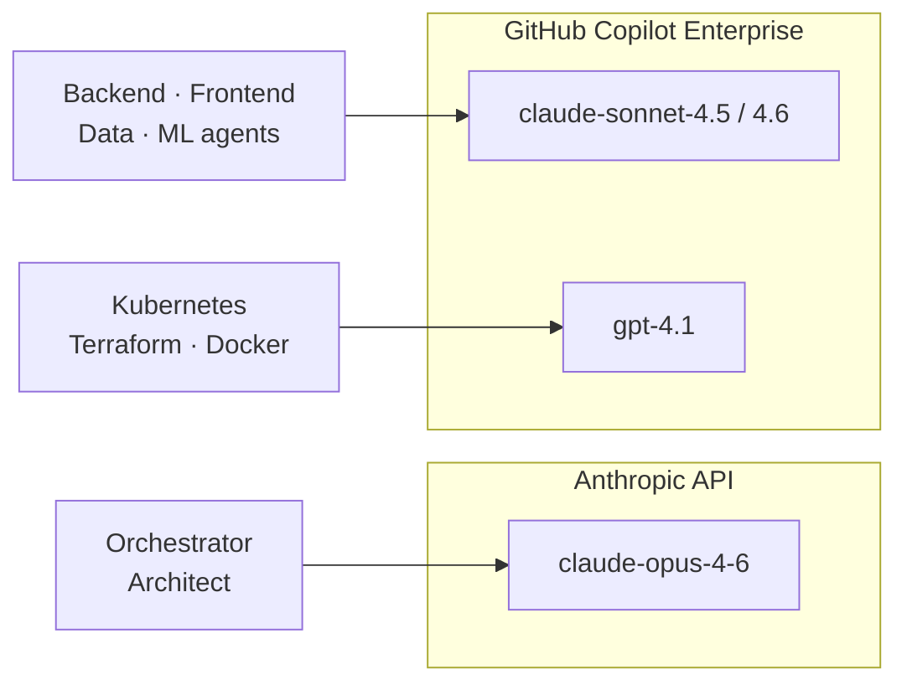

# Quickstart — OpenCode

This guide gets you from zero to a running feature pipeline using **OpenCode** with **GitHub Copilot Enterprise** (and optionally the Anthropic API for orchestration).

---

## Prerequisites

| Tool | Install |
|---|---|
| [OpenCode](https://opencode.ai) | See [opencode.ai](https://opencode.ai) |
| [GitHub CLI](https://cli.github.com) | `brew install gh` |
| [Git](https://git-scm.com) | pre-installed on macOS/Linux |
| [Node.js](https://nodejs.org) | `brew install node` |
| [Docker](https://docker.com) | [docker.com/get-started](https://docker.com/get-started) |

**License requirements:**

| Agent category | Model | License needed |
|---|---|---|
| Orchestrator, Architect | `anthropic/claude-opus-4-6` | Anthropic API key |
| Implementation agents | `github-copilot/claude-sonnet-4.5` | GitHub Copilot Enterprise |
| Infrastructure agents | `copilot/gpt-4.1` | GitHub Copilot Enterprise |

> You can run with Copilot Enterprise alone by reconfiguring the orchestrator to use a Copilot model. `ai-squad init` will walk you through this interactively.

---

## Model routing



---

## Installation

### 1. Install the CLI globally

```bash
git clone https://github.com/kinncj/AI-Development-Squad-Template.git ~/.ai-squad
echo 'export PATH="$HOME/.ai-squad/scripts:$PATH"' >> ~/.zshrc
source ~/.zshrc
```

### 2. Scaffold a new project

```bash
mkdir my-project && cd my-project
ai-squad init
```

During `ai-squad init` you will be asked which providers you have. Answer honestly — the wizard rewrites all 27 agent `.md` files and `opencode.json` to use the right `provider/model-id` strings for your subscription.

**If you have both Anthropic API + GitHub Copilot Enterprise:**
- Orchestrator and Architect → `anthropic/claude-opus-4-6`
- All other agents → `github-copilot/claude-sonnet-4.5`

**If you have GitHub Copilot Enterprise only:**
- All agents → `github-copilot/claude-sonnet-4.5` (or 4.6 if available)

**If you have no commercial subscription:**
- `ai-squad init` will offer free cloud models (opencode.ai) and local Ollama models

### 3. Connect providers in OpenCode

After scaffolding, open OpenCode in your project and configure providers:

- **Anthropic API:** `opencode → Settings → Providers → Anthropic` — paste your API key
- **GitHub Copilot:** `opencode → Settings → Providers → GitHub Copilot` — authenticate with GitHub

### 4. Connect a remote repository

```bash
gh auth login
gh repo create my-project --public --push --source=.
ai-squad labels
```

---

## Running your first feature

Open OpenCode in your project directory:

```bash
opencode
```

Then run a command:

```
/feature "describe your feature here"
```

OpenCode will invoke the orchestrator agent, which drives the full 8-phase pipeline. Sub-agents run as navigable child sessions — use the OpenCode session navigator to switch between them.

---

## Available commands

| Command | What it does |
|---|---|
| `/feature "description"` | Full 8-phase pipeline from discovery to PR |
| `/build-feature "description"` | Alias for `/feature` |
| `/bugfix "description"` | Reproduce → fix → validate → CHANGELOG |
| `/validate` | Run the full test suite (no discovery/architecture) |
| `/tdd "requirement"` | Single RED → GREEN → REFACTOR cycle |

---

## Project structure after `ai-squad init`

```
my-project/
├── .opencode/
│   ├── agents/          # 27 agent definitions (OpenCode frontmatter)
│   ├── commands/        # /feature, /bugfix, /validate, /tdd
│   └── skills/          # 17 reusable skill files
├── .claude/             # Mirror for Claude Code platform
├── opencode.json        # OpenCode project config (model routing)
├── Makefile             # 13-target build/test contract
├── docker-compose.test.yml
└── docs/specs/          # Pipeline artifact output
```

---

## OpenCode agent format

OpenCode agents use richer frontmatter than Claude Code agents. Example:

```markdown
---
name: typescript
model: github-copilot/claude-sonnet-4.5
temperature: 0.2
mode: code
tools:
  - read
  - edit
  - write
  - bash
permission:
  allow:
    - bash: ["npx", "node", "npm", "tsc", "jest", "vitest"]
---

You are the TypeScript specialist...
```

The `permission.allow` list restricts which shell commands each agent can run — preventing one agent from accidentally touching another's domain.

---

## Customizing model IDs

When new Claude or Copilot model versions are released:

1. Update `opencode.json` → `model.default`
2. Update each `.opencode/agents/*.md` → `model:` field
3. Or re-run `ai-squad init --yes` and answer the provider prompts again

See [Customization Guide](./customization.md) for details.

---

## Troubleshooting

**`opencode: command not found`**
Install OpenCode from [opencode.ai](https://opencode.ai).

**Agent uses wrong model**
Check `.opencode/agents/{name}.md` — the `model:` field must match your provider's exact model ID string. Use `opencode → Settings → Providers` to verify available model IDs.

**Orchestrator cannot invoke sub-agents**
Ensure the agent name is listed in `orchestrator.md` under `permission.task`. OpenCode enforces this allowlist strictly.

**API key errors from Anthropic provider**
Set your key in OpenCode's provider settings UI, not via environment variable. OpenCode manages credentials through its own config store.
