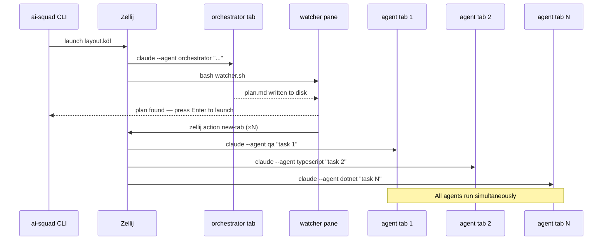
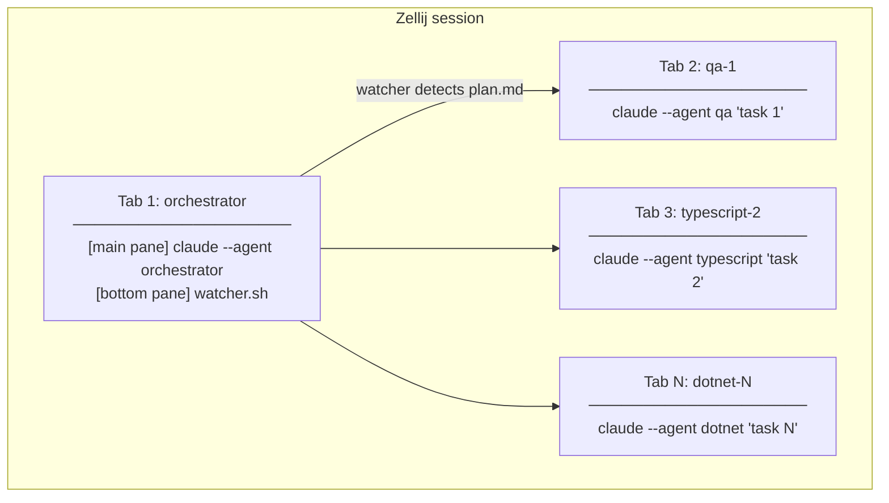

# Swarm Mode

Swarm mode runs multiple agents in parallel — one Zellij tab per task — dramatically reducing wall-clock time for large features.

**Platform:** Claude Code only. OpenCode runs sub-agents as navigable child sessions natively.

---

## How it works



---

## Prerequisites

- [Zellij](https://zellij.dev) >= 0.41.0: `brew install zellij`
- Claude Code installed and authenticated
- Do **not** run from inside an existing Zellij session (use `Ctrl-o d` to detach first)

---

## Commands

### `swarm feature` — recommended entry point

Runs the full 8-phase pipeline. The orchestrator plans, then agents are launched automatically.

```bash
ai-squad swarm feature "create a plain C and a static HTML version of the weather app"
```

What happens step by step:
1. A Zellij session opens with an **orchestrator** tab (Claude drives Phases 1–3)
2. A **watcher** pane polls `docs/specs/*/plan.md` every 3 seconds
3. Once `plan.md` appears, you are prompted to press Enter (or it auto-launches after 10 s)
4. One new tab opens per task — each running the appropriate specialist agent
5. Navigate between tabs; the orchestrator tab is always tab 1

### `swarm full` — launch from existing plan

Reads `docs/specs/current/plan.md` and launches all unchecked tasks immediately.

```bash
ai-squad swarm full
```

Set a custom plan file:

```bash
PLAN_FILE=docs/specs/my-feature/plan.md ai-squad swarm full
```

### `swarm tasks` — cherry-pick tasks

Launch specific task numbers from the plan.

```bash
ai-squad swarm tasks 3 5 7
```

Useful when some tasks have already completed and you only need to resume specific ones.

### `swarm agent` — single agent

Run one named agent with a custom prompt.

```bash
ai-squad swarm agent @dotnet "make the test at tests/unit/OrderTests.cs pass"
ai-squad swarm agent @qa "write failing tests for the payment service"
```

---

## Navigating inside Zellij

### Tabs — one per agent

Each agent runs in its own tab. Tab 1 is always the orchestrator (or the single agent for `swarm agent`).

| Action | macOS | Linux | Windows (WSL) |
|---|---|---|---|
| Next tab | `⌥ n` | `Alt-n` | `Alt-n` |
| Previous tab | `⌥ p` | `Alt-p` | `Alt-p` |
| Jump to tab 1 (orchestrator) | `⌥ 1` | `Alt-1` | `Alt-1` |
| Jump to tab N | `⌥ N` | `Alt-N` | `Alt-N` |
| Tab manager / overview | `Ctrl-t` | `Ctrl-t` | `Ctrl-t` |

> **macOS — Option key:**
> ⌥ is the **Option** key. Your terminal must forward it as an Alt escape sequence.
> - **iTerm2**: works out of the box
> - **Terminal.app**: Preferences → Profiles → Keyboard → enable **"Use Option as Meta key"**
> - **Ghostty / Warp / Kitty**: enabled by default

> **Windows:** run Zellij inside **WSL 2** using **Windows Terminal**. `Alt` keys work natively.

### Panes — within a tab

The `swarm feature` orchestrator tab has two panes: the main orchestrator pane and the watcher pane at the bottom.

| Action | macOS / Linux / Windows |
|---|---|
| Move focus to another pane | `Ctrl-p` then `Arrow key` |
| Zoom / fullscreen focused pane | `Ctrl-p` then `z` |
| Close focused pane | `Ctrl-p` then `x` |

### Session management

| Action | Key / Command |
|---|---|
| Detach (session keeps running) | `Ctrl-o` then `d` |
| List running sessions | `zellij list-sessions` |
| Reattach to a session | `zellij attach <name>` |
| Kill a session (from outside Zellij) | `zellij kill-session <name>` |

---

## Layout diagram



---

## Troubleshooting

**`There is no active session!`**
You are inside an existing Zellij session. Detach first: `Ctrl-o d`, then re-run.

**`zellij: command not found`**
Install Zellij: `brew install zellij`. Minimum version 0.41.0.

**`Failed to parse Zellij configuration`**
A KDL layout syntax error. This is a bug — please [open an issue](https://github.com/kinncj/AI-Development-Squad-Template/issues) with the error text.

**Watcher never detects plan.md**
The orchestrator may still be in Phases 1–2 (awaiting human gates). Check the orchestrator tab. The watcher polls every 3 seconds — it will pick up the file automatically once Phase 3 completes.

**Agent tab exits immediately**
Claude Code is not installed or not in PATH. Verify: `which claude`. If missing: `npm install -g @anthropic-ai/claude-code`.
