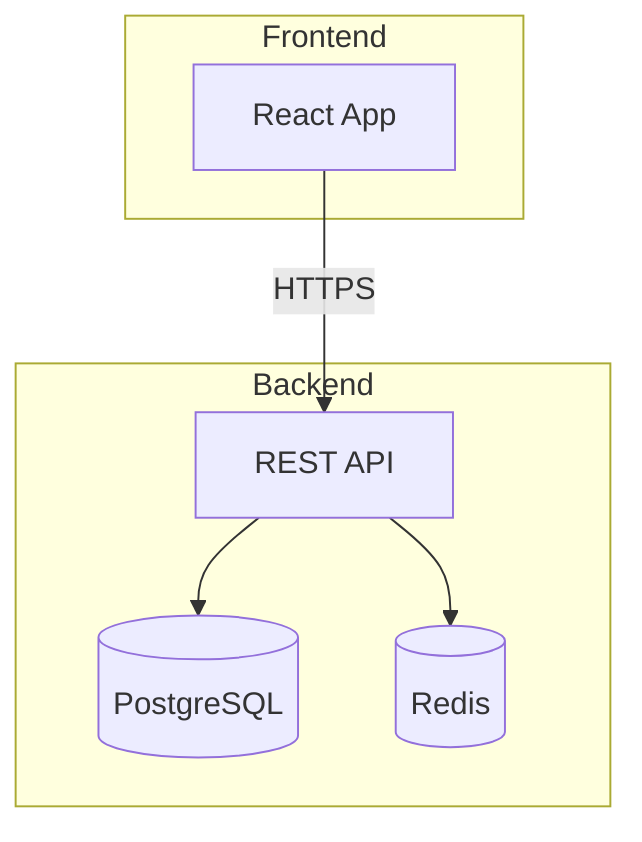
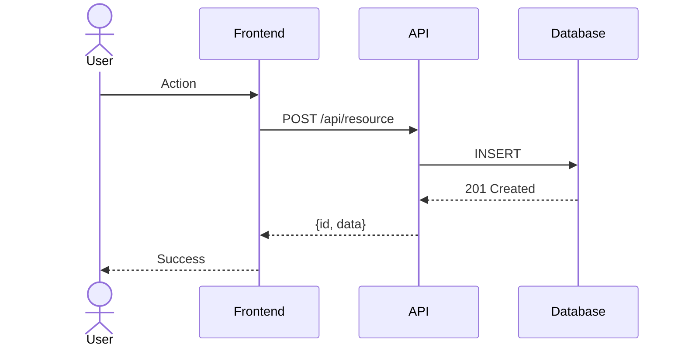
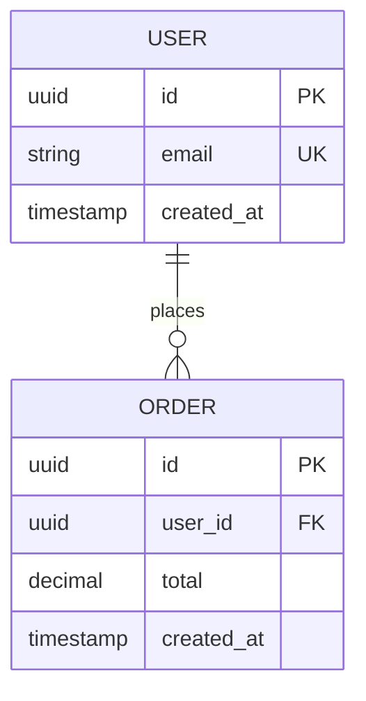
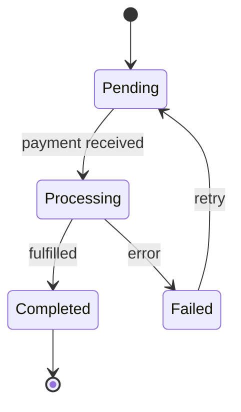
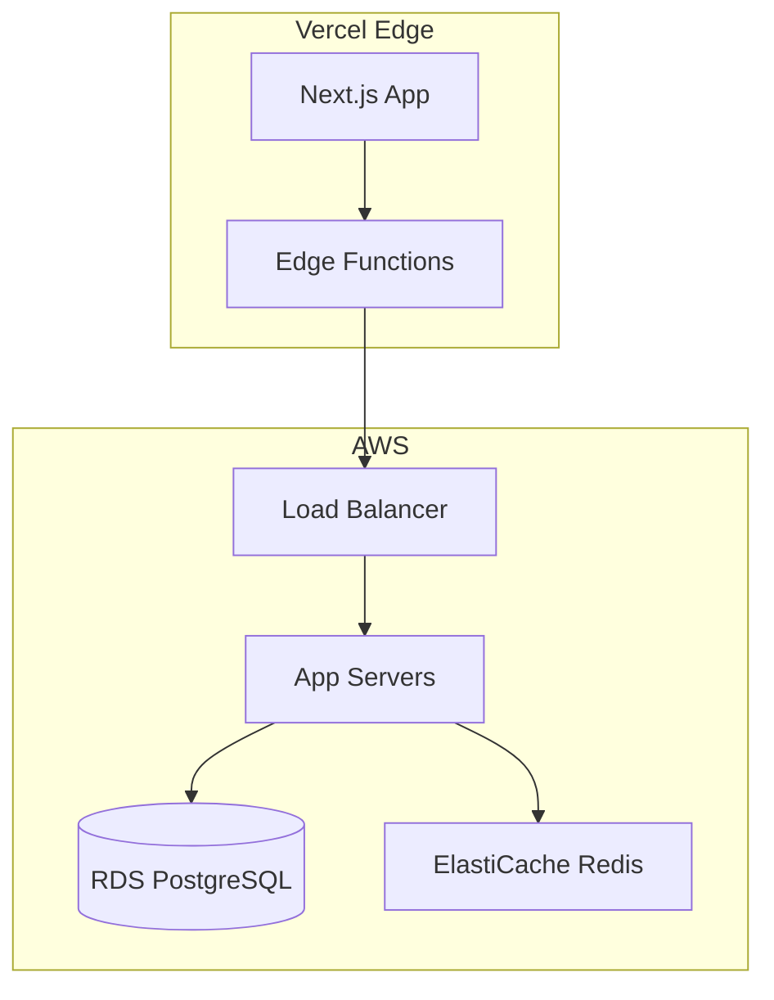

# SKILL: Mermaid Diagrams

## Required Diagrams Per Feature
1. Component diagram (`graph TB`)
2. Sequence diagram (`sequenceDiagram`)
3. ER diagram (`erDiagram`)
4. Deployment diagram (`graph TB` with deployment focus)
5. State machine (`stateDiagram-v2`) — where applicable

## Rules
- Maximum 30 nodes per diagram.
- All diagrams must be syntactically valid.
- Test diagrams in the Mermaid Live Editor before committing.
- Use descriptive node labels.

## Component Diagram

## Sequence Diagram

## ER Diagram

## State Machine

## Deployment Diagram

